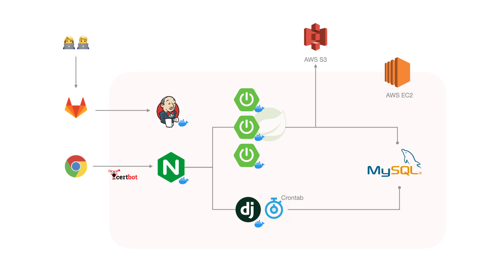

# :bookmark: 목차

- [**서비스 소개**](#diamonds-서비스-소개)
- [**추천 알고리즘 소개**](#hearts-추천-알고리즘-소개)
- [**팀 소개**](#spades-팀-소개)
- [**기술 스택**](#clubs-기술-스택)
- [**서버 아키텍쳐**](#bookmark_tabs-서버-아키텍쳐)
- [**ERD**](#bookmark_tabs-ERD)
- [**사이트 레이아웃**](#books-사이트-레이아웃)

# :diamonds: 서비스 소개
#### 라이프스타일 기반 빅데이터 와인추천서비스 15.5도
> 와인을 마시기 가장 좋은 온도, 가장 맛있는 와인의 도수 15.5도 
> 15.5도는 국내에서 유통되고 있는 와인 1,695종, 글로벌 와인 애호가 15,135명의 리뷰 101,314개를 기반으로 최적의 와인을 추천 드립니다. 

협업 필터링 추천 알고리즘을 기반으로 추천 로직을 구현하였으며 '라이프스타일' 콘셉트를 도입하여  
협업 필터링 알고리즘의 최대 약점인 콜드스타트 문제(첫 가입 유저는 상품에 대한 평가데이터가 없어 추천해주지 못하는 문제) 를 해결함과 동시에 
나와 같은 라이프스타일인 유저를 찾아보는 재미를 느낄 수 있으며 
자세한 와인 정보 없이도 다양한 추천을 받을 수 있는 서비스입니다. 
- 소개 바로가기 : https://j6a307.p.ssafy.io/about

#### :wine_glass: 기획배경
> 최근 혼술을 하는 인원의 수가 많이 늘어나고 있습니다.  
또한 이마트, 편의점, 백화점 등에도 와인을 쉽게 접하면서 와인에 대한 관심도가 높아지고 있습니다. 
하지만 관심도에 비해 개인화된 와인 추천을 받을 수 있는 서비스는 찾기 어렵습니다.  
15.5도는 와인 입문자들도 라이프스타일만 선택하면 만족스러운 와인을 추천받을 수 있도록 기획하였습니다.  

#### UCC
https://www.youtube.com/watch?v=lle-oZIPz_k&feature=youtu.be

#### 최종 발표자료
https://shorturl.at/dlowE

#### :wine_glass: 주요기능
- 와인 Top 10 순위
- 라이프스타일 별 와인 추천
- 와인 검색
- 와인 상세보기
- 와인 냉장고(북마크)
- 리뷰

# :hearts: 추천 알고리즘 소개
### 협업 필터링 알고리즘이란?

- 나와 유사한 유저가 높은 평점을 준 와인을 추천 : user-based 
- 내가 높은 평점을 준 와인과 유사한 와인 : item-based 
→ 따라서 콜드스타트 문제가 발생 (첫 가입 유저는 리뷰나 위시리스트 등 상품에 대한 평가데이터가 없기 때문) 
→ 15.5도는 라이프스타일이라는 개념을 도입하여 흥미유발과 동시에 콜드스타트 문제를 해결 

### 15.5도 로직
#### :wine_glass: Memory-based 협업 필터링
##### user-based Collaborative Filtering 
- 유사한 유저가 높은 평점을 준 와인 추천
##### Item-based Collaborative Filtering
- 유저가 4점 이상 준 와인과 위시리스트에 담은 와인 중 한 와인과 유사한 와인을 추천

#### :wine_glass: 데이터 크롤링
##### 참고사이트
> **vivino - https://www.vivino.com/US-CA/en/**   
> **wine21 - https://www.wine21.com/**

##### 라이브러리

##### 크롤링 데이터

- 평점: 101314개
- 와인: 1695개
- 유저: 15135명

# :spades: 팀 소개

#### 팀 구성
|이름|역할|비고|
|------|----|-------|
|방의진|팀장|BE개발 - Spring-boot, 인프라 조성|
|김동영|팀원|BE개발 - Spring-boot|
|채예은|팀원|BE개발 - Python, Django, 추천알고리즘 개발|
|유재룡|팀원|BE개발 - Python, Django, DB관리|
|김선민|팀원|FE개발 - React, UI/UX개발|
|나지엽|팀원|FE개발 - React, UI/UX개발|

#### 상세 역할
|  이름  |        역할        | 
개발 내용
 |
| :----: | :----------------: | :--------------------------------------------------------------------------------------------------------------------------------------------------------------------------------------------------------------------------------------------------------------------------------------------------------------------------------------------------------------------------------------------------------------------------------------------------------------------------------------------------------------------------------------------------------------------------------------------------------------------------------------------------------------------------------------------------------------------------------------------------------------------------------------------------------------------------------------------------------------------------------------------------------------------------------------------------------------------------------------------------------------------------------------------------------------------------------------- |
| 방의진 | Back-end 팀장 | - DB 설계 - Spring Data JPA & Swagger API 세팅  - Spring Boot로 RESTful API 작성(유저 관리 API, 와인정보 API, 리뷰 API) - 스프링 시큐리티, JWT를 이용한 인증 구현 - 대량의 이미지 처리를 위한 Amazon S3 Bucket 연동 - EC2 인프라 환경 세팅 및 배포   - Gitlab webhook, Jenkins, Docker를 활용한 CI/CD - Letsencrypt, Certbot을 이용한 서비스 SSL 보안 적용 - Nginx 웹서버 적용(Load Balancing, Reverse Proxy, Service Redirect설정) - 트래픽 분산을 위해 여러 대의 스프링 도커 서버로 리버스프록시 구성  - 도커 컨테이너 환경에서 장고-크론탭 실행   - 프로젝트 관리(Notion, Mattermost, Jira) |
| 김동영 |      Back-end      |  - Spring-boot API 구현(마이페이지 API)  - UCC 제작  - API 연동 테스트  |
| 채예은 |      Back-end      | - DB 설계 - Selenium, Beautiful soup을 활용해 와인 리뷰 데이터 크롤링 - Pandas로 수집한 데이터 전처리 & 정제 - Django로 평점, 위시리스트를 통한 User-based,  Item-based 협업 필터링 추천 시스템 구현 - Crontab으로 Django 추천 알고리즘 주기적 실행 - 프론트엔드 디자인 수정  |
| 유재룡 |     Back-end       |  - DB 설계 - Python를 이용한 Data 크롤링 - Springboot와 Django 간의 API 구축 및 연결 - CSV 및 Python을 이용한 데이터 정제 및 MySQL 데이터 삽입 - DB 및 ERD 제작 및 관리  - Readme, PPT 등 문서 작업 |
| 김선민 |     Front-end     |    - React와 Route를 사용하여 SPA 및 조건부 렌더링 구현 - Redux를 사용하여 전역 상태 관리 - Axios를 이용한 API 비동기 통신 - styled-components와 material-ui를 이용한 레이아웃 구현 및 css 스타일링 - UCC 시연 영상 제작  |
| 나지엽 |     Front-end      | - React, Route, Redux를 사용하여 SPA 및 조건부 렌더링 구현 - Axios를 이용한 API 비동기 통신 - styled-component와 material-ui, react slick을 이용한 레이아웃 구현 및 css 스타일링   |

# :clubs: 기술 스택

#### FE

 

#### BE
 
 

 

#### server

#### 프로젝트 관리

# :bookmark_tabs: 서버 아키텍쳐

# :bookmark_tabs: ERD

# :books: 사이트 레이아웃
#### :wine_glass: 홈페이지 주소
- **https://j6a307.p.ssafy.io/**

#### :wine_glass: 메인화면

#### :wine_glass: 라이프 스타일 선택 화면

#### :wine_glass: 와인 상세 페이지

#### :wine_glass: 마이 페이지

